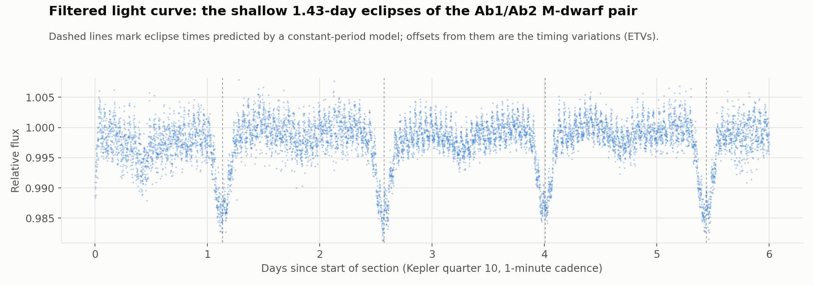

# Eclipse Timing Variations of KIC 4150611

Searching NASA Kepler data for an unseen object hidden in a quintuple star system, by measuring how its eclipses arrive slightly early or late.

**Result:** fitting eclipse timing variations (ETVs) across 496 eclipses uncovered a **635-day periodic signal**. It points to a potential companion object with an estimated mass of **0.097 solar masses** and a semi-major axis of **1.96 AU**. Along the way, the eclipse period of the system's inner M-dwarf pair was measured at **1.43415 ± 0.00028 days**, within 0.004% of the published value.

> UNSW School of Physics research internship (Sep–Dec 2022), supervised by Dr Ben Montet.
> Full write-up: [`KIC4150611_ETV_Report.pdf`](KIC4150611_ETV_Report.pdf)



---

## Background

KIC 4150611 is one of the brightest eclipsing systems observed by the Kepler space telescope. It is a rare **quintuple star system** with four separate eclipse periods: 94.2, 8.65, 1.52 and 1.43 days. Earlier work (Hełminiak et al. 2017) could not confirm which stars produce the 1.43-day eclipses.

If two stars orbit each other in a perfect two-body orbit, their eclipses repeat like clockwork. When eclipses arrive early or late, something else is tugging on the pair. Measuring these **eclipse timing variations** is a way to detect, and estimate the mass of, objects that can't be seen directly.

## Approach

1. **Data selection.** Kepler quarters 7 to 15 of short-cadence (1-minute) photometry from the Mikulski Archive for Space Telescopes (MAST), covering about 2.5 years.
2. **Filtering.** Removed pulsations from the bright primary star and the deeper eclipses of the other components, isolating the faint 1.43-day signal of the Ab1/Ab2 M-dwarf pair.
3. **Bayesian light-curve fitting.** Each quarter was split into three sections and fitted with [`juliet`](https://github.com/nespinoza/juliet), which uses `batman` for the eclipse model and `dynesty` nested sampling for the posteriors. Each fit took 5 hours to over a day, so all **27 fits were run in parallel** on UNSW's Katana HPC cluster, cutting total compute time by about 82%.
4. **O − C analysis.** Observed eclipse times were compared with a constant-period model, then the sections were stitched into a single 2.5-year timing curve.
5. **Signal modelling.** The stitched timing variations were fitted with SciPy non-linear least squares, using two sine terms and a linear trend: one sine for the known 94.2-day orbit around the primary star, and one for a potential additional perturber.
6. **Characterisation.** The amplitude of the perturber's signal (39.8 seconds of light-travel delay) and its period were combined with Kepler's third law to estimate the object's mass and orbit.

## Results

| Quantity | Value |
|---|---|
| Eclipses observed | 496 |
| Ab1/Ab2 eclipse period | 1.43415 ± 0.00028 days |
| Perturber period | ~635 days |
| Perturber mass | ~0.097 M☉ |
| Perturber semi-major axis | ~1.96 AU |

The fitted parameters are plausible, but the uncertainties on the perturber's properties could not be quantified within the scope of this project. See the report's discussion for the limitations and possible next steps.

## Repository contents

| Path | What it contains |
|---|---|
| `Engineering ETV Data.ipynb` | Loads one filtered section, sets priors, fits the eclipse model with `juliet`, and extracts the O − C timing variations |
| `Mstar/` | Filtered Kepler light curves for each quarter and section (`KIC4150611_qXX_N.csv`), with time, flux, flux error, centroid and quality columns |
| `KIC4150611_ETV_Report.pdf` | Full report: background, method, results and discussion |
| `images/` | Figures used in this README |

## Running the notebook

```bash
pip install numpy matplotlib juliet dynesty batman-package
```

The notebook asks for a quarter number and a section number (for example `10` and `1`), loads `Mstar/KIC4150611_q10_1.csv`, and runs the fit. Expect each section to take several hours on a laptop.
